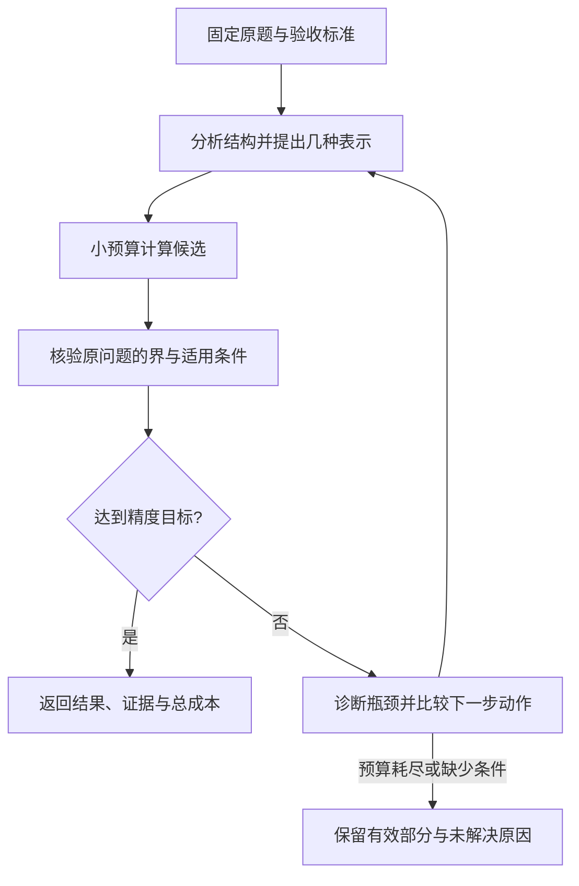

# 几何研究工具：框架重搭讨论稿

日期：2026-09-18。状态：brainstorm，尚未实施。保留精度优先的要求，暂停按版本数量推进。此前实现和证书作为基线保存，不在本轮改写。方法来源结论见 [原创性检查](../geometry_originality_audit/REPORT.md)。

## 要解决的核心问题

希望工具能让模型在难题上取得显著的实际收益。当前最大的缺口是：识别奇点、选择分数幂、决定换路线和分配预算主要由开发者完成。程序会计算和检查结果，却还没有承担这些研究决策。单题达到很窄的谱区间证明具体计算有效，不能证明面对新题时会自动找到有效路线。

新框架的研究假设是：**从方程结构提出函数表示，再用完整误差证据筛选和修正表示，可能比固定函数族或无诊断的试错更节省达到目标精度的总成本。** 这是待检验的假设，不是已获成果或原创性主张。

首个落点仍是几何分析中的谱与不等式估计：它们能给出明确目标、可量化误差和可复核验收。上层保留更换数学内核的接口，但第一阶段不追求覆盖所有几何研究问题。

## 三条可选研究方向

| 方向 | 关键研究动作 | 优势 | 首要障碍 |
|---|---|---|---|
| 从方程生成表示 | 识别局部主导项、对称性与边界条件，生成幂、对数或其他候选函数 | 可解释，可能用少量项获得高精度 | 结构识别和共振处理不能靠逐题手写；局部展开不保证全域有效 |
| 从残差生成修正 | 分析完整残差，经合适的预条件或平滑步骤产生新方向 | 能修正初始猜测遗漏的全域信息 | 原始残差未必属于算子定义域；谱聚簇和小间隙使标量认证困难 |
| 在区域间组合表示 | 光滑区、多尺度奇点区和跳跃界面采用不同表示并分配预算 | 能处理单个全局基不适合的混合结构 | 拼接条件、几何误差和各层误差传递增加认证成本 |

建议先验证前两条的结合：结构给出初始候选，残差决定是否值得加项或换路线。第三条作为明确失败类型出现后的扩展。奇点适配已有 [Müntz 谱方法](https://arxiv.org/abs/2303.05020)，残差预条件求解已有 [LOBPCG 等方法](https://arxiv.org/abs/1708.08354)，分层修正也有 [自适应特征值算法](https://epubs.siam.org/doi/10.1137/17M1138157)。因此，“自动化”或“组合”两个词本身不证明创新；需要展示新增的能力及成本收益。

## 一轮研究怎样运转

系统至少需要以下五类对象，但可以先用少量模块实现，不需要大型平台。

**原题对象。** 记录几何、算子或待证不等式、定义域、约束、目标量、精度与允许假设。势函数的表示和未知特征函数的表示分开。每次变换都指回同一原题，说明是等价变换、上/下界还是带误差近似。特别保留零均值、全部方位角、边界条件，防止某个子问题成功被当成原题成功。

**表示候选。** 记录函数族、生成理由、定义域条件、预计矩阵/积分成本和可用认证路线。例如“局部指数平衡推导的分数幂集合”与“通过采样猜出的函数形状”应有不同证据状态。不把同一道题的硬编码函数表当成自动生成。

**计算与验证内核。** 复用精确积分、变分界、Schur 尾部、完整残差、形式误差传递和区间检查。候选允许使用近似数值；接纳结果时必须核对原题及认证条件。需要明确验证器信任哪些程序与定理；当前有理数检查尚非证明助手形式化，也不能因为生成器与检查器共享代码便称完全独立。

**诊断记录。** 区分表示误差、未覆盖的空间或谱尾、间隙不足、算术误差、定义域失败和证明条件缺失。只有在存在合法分解时才报告误差分量；不能将所有区间宽度强行拆成可加误差。否则用小预算对照标明“推测的瓶颈”，而非声称已证明某项主导。

**行动选择器。** 第一阶段只开放少数动作：扩展当前基、换表示、加强尾界、改善候选求解、提高算术精度、请求模型推导缺失的结构或辅助界。先用小预算试探，再按实际有效区间的改善与总成本更新选择。允许保留两条有希望的路线，及时停止无收益路线；当前只提出启发式选择，不宣称全局最优调度。

## 具体到已经做过的奇异势

对 `q(z)=-a|z|^(-α)`，在当前 m=1 实分量和合适参数条件下，局部二阶导数与势的奇异项平衡会提示首个非光滑指数 `2-α`。因此，α=1/4 对应 7/4。新程序应从输入方程推导这个候选，而不是保存“此题使用 7/4”的答案表。

局部推导只是起点。随后应检查试探函数属于所需定义域，计算完整原算子残差，再判断是否需要补充全域光滑项、进一步的奇异项或其他表示。对参数变化，间隙界、相对二次型条件和最低谱所在分量必须重新核对；旧题中 m=1 的结论不可自动继承。

如果完整残差已小、最终区间仍宽，可能是间隙或其他分量下界成为瓶颈，此时继续增加同一基的项数未必有效。若只提高算术精度而证书不变，也应停止该方向。动作的价值取决于最终验收目标，不取决于某个中间量是否漂亮。

残差修正可探索 `δu≈-(H₀+σ)⁻¹r` 一类平滑步骤，但须核验所选算子及映射条件。这只是产生候选的机制，不保证一次修正改善目标。分区表示若用于强残差，还必须处理界面匹配，避免遗漏导数跳跃产生的分布项。

## 精度与资源怎样排序

用户先给目标精度与总预算。优先满足经过验证的精度要求，再比较完成成本。未达目标的运行保留有效界及失败原因，不能只报告成功案例的平均速度。

首要指标是给定预算下的通过率；其次是达到相同认证精度的总耗时、实际模型用量、工具计算成本与证书体积。多目标可以报告几组成本互不占优的选择，第一阶段不需要把所有量随意加成一个分数。

token 省在减少重复决策和重复传输：程序处理常规循环，模型主要参与新的结构假设、表示选择和证明策略。默认回执包含当前界、认证状态、诊断、已尝试动作、成本及证据引用，按需取完整细节。分别记录实际模型输入/输出及能取得的推理用量、工具可见文本、模型外计算成本；词表估算不能冒充真实推理用量。

缓存命中和首次运行分开报告。提前推导、编码、搜索和制作模板的成本应单列，并说明在多少新任务上摊销；不能把开发者已完成的研究藏在工具里，再把查表速度当成新题研究速度。

## 最小实验：先检验是否值得重搭

第一批实验可用少量开发题建立结构规则，再冻结策略。留出题至少包含两种层次：同一机制的新参数，以及需要不同表示选择的另一问题族。仅将 α 从 1/4 换成 1/3，足以检查是否硬编码指数，但不足证明跨问题族泛化。跳跃、平滑扰动和弱非轴对称耦合可作为后续差异来源；超出当期支持范围的题应诚实拒绝或输出未解决状态。

比较对象应包括：当前固定工具路线、成熟适配方法在相同问题上的实现，以及模型使用通用编程/数值工具的路线。每组固定原题、资料权限、验收器及资源预算。先比较同一个模型；再做模型与工具的交叉对照，避免把大模型、额外资料或预先计算的差异算作框架收益。

建议加入两项消融：移除结构生成，只靠残差；移除残差反馈，只按预定列表加项。这样才能辨别收益来自哪个机制。对“成本控制器”的评价还应包括它自己的试探和诊断开销。

如果新框架必须逐题改函数表、只比普通多项式强、或诊断成本抵消全部收益，就应修改或放弃对应机制。若它在留出题上能自动产生合法表示、用完整证书达到目标，并减少总资源，才有理由扩大范围并继续研究其理论。

## 本轮决策建议

保留现有算法与证书底座；将下一阶段的核心研究命题收敛为“结构生成与完整残差反馈，是否能够自动找到更省成本的高精度函数表示”。先以少量数学动作和明确验收器检验，不按版本数计进度。

工具自身有用与算法具有学术原创性分别评估。前者依靠留出题上的完整流程表现，后者还需明确的新命题、最接近文献对照及可证明的区别。两者都不能仅由单题达到更多小数位推出。
